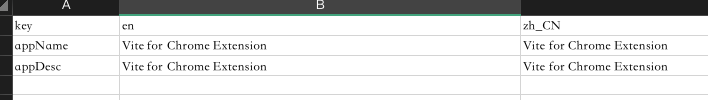

# Vite + Vue 3 + Chrome Extension + tailwindcss

Vite Vue 3 for Chrome Extension

## Usage

Folder dictionary like below:

```bash
- chrome # for manifest, _locales, assets logo
  - assets # logo
  - _locales # locales
  - manifest.json # manifest for v3
- public # for some image assets
- src
  - background # background service worker script
  - content_scripts # content_scripts script
  
  - override # override page
  - popup # popup page
  - option # option page
  
- popup.html # popup.html
- option.html # option
- override.html # override

- build.sh # build shell

- vite.config.script.js # for background content_scripts project // lib mode
- vite.config.js # for option, override, popup // multi module
```

Because of vite lib mode and module mode cannot build as the same time.
And the lib mode alse need to import asset and vue file, so make another vite config file to build the lib bundle.

Then build whole project to gen dist folder.
Now support background work, popup and override.

```javascript
npm initall

npm run build
```

Build shell compile projects and copy or move files. Some like below.

```base
mkdir dist
rm -rf dist/* &&\

vite build -c vite.config.js &&\
vite build -c vite.config.script.js &&\

cp -rf chrome/* dist
```

### local
Multi language support, add corresponding copy in the local. xlsx file, and execute the genLocal. py file to generate corresponding multi language support.



```python
python genLocal.py
```


